# Mediatekformation - Extension Back-Office

## Présentation
Ce site est une évolution de l'application **Mediatekformation**, développée avec Symfony 6.4. Il permet d'accéder aux vidéos d'auto-formation proposées par une chaîne de médiathèques, initialement consultables sur YouTube.

Le dépôt d'origine, contenant la présentation complète de l'application initiale (Front-Office), est disponible ici : [Lien vers le dépôt d'origine](https://github.com/CNED-SLAM/mediatekformation)

---

## Fonctionnalités ajoutées (Back-Office)

En plus des fonctionnalités de consultation (Accueil, Formations, Playlists, CGU), une partie **Administration** sécurisée a été mise en place pour gérer le contenu du site :

### 🔐 Sécurité et Authentification
* **Espace protégé** : L'accès aux fonctionnalités d'ajout, modification et suppression est réservé aux administrateurs connectés.
* **Formulaire de connexion** : Système d'authentification robuste via le composant Security de Symfony.

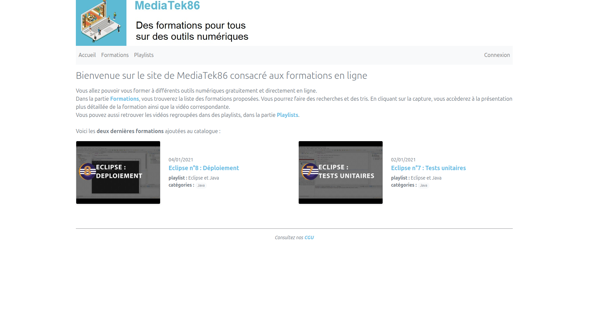
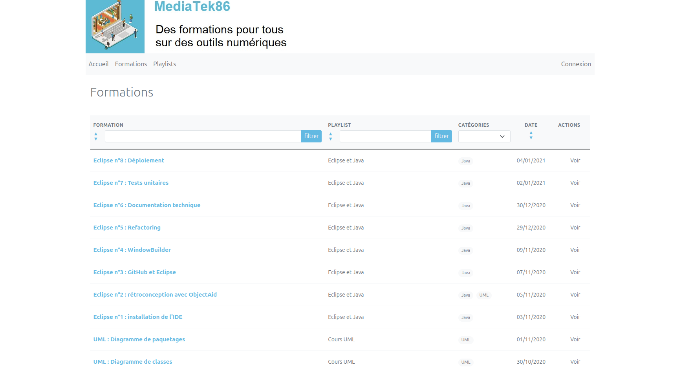
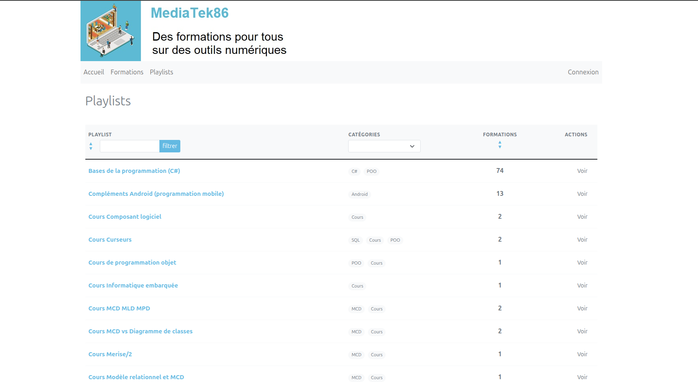
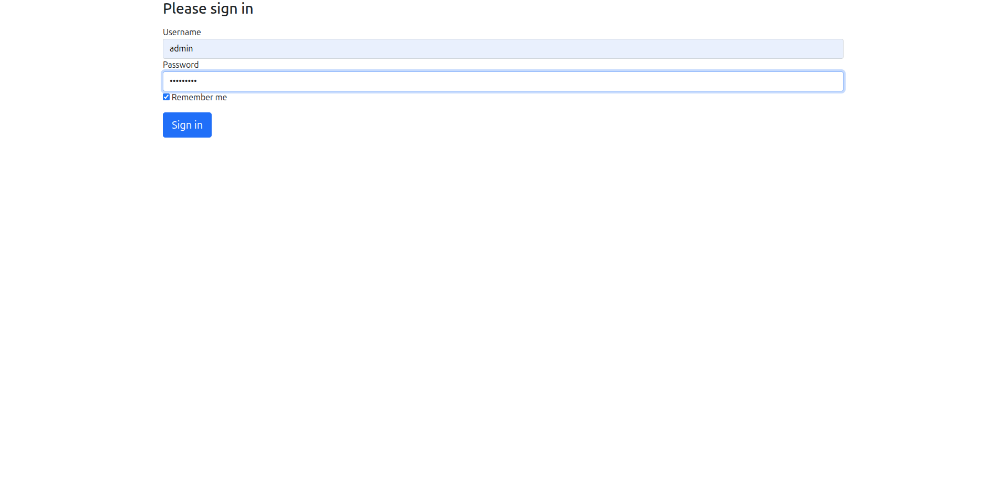
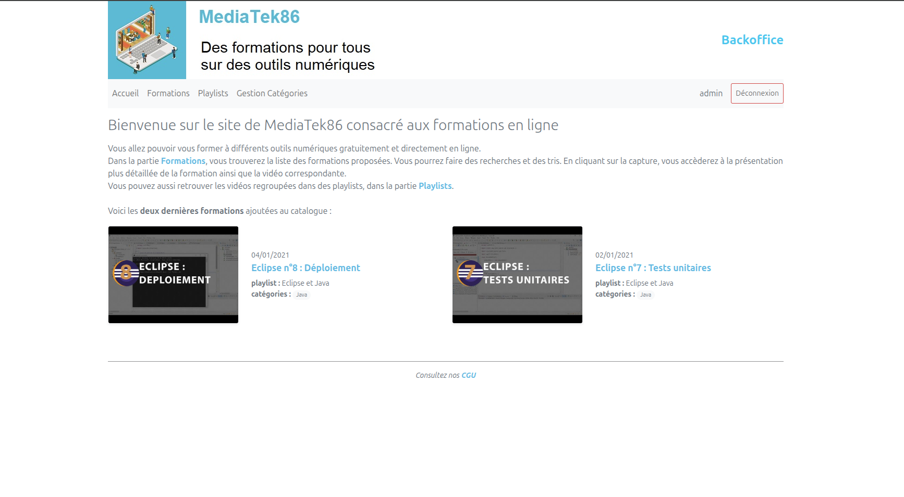

### 🎬 Gestion des Formations
* **CRUD Complet** : Ajout, modification et suppression des formations.
* **Validation des données** : Contrôle strict des champs (titre, lien YouTube, date) pour assurer la cohérence de la base.
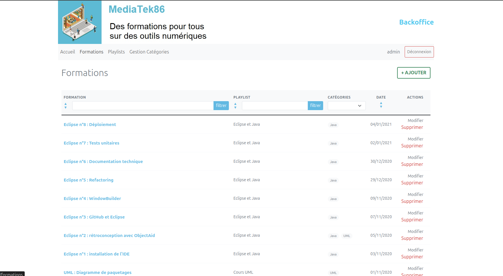
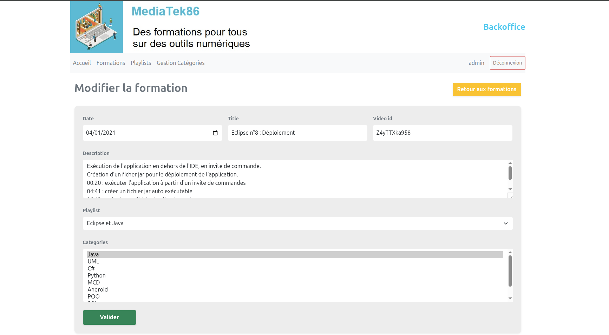
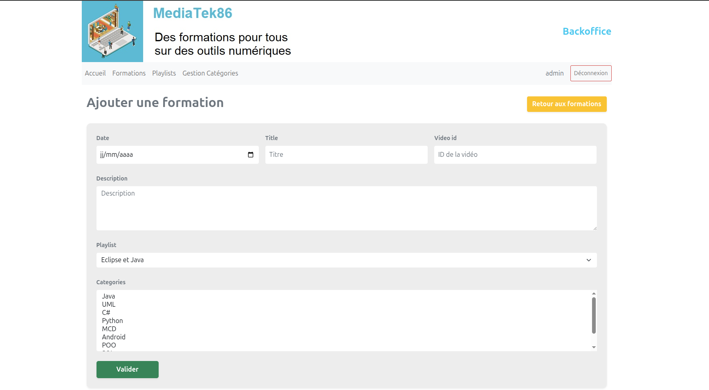
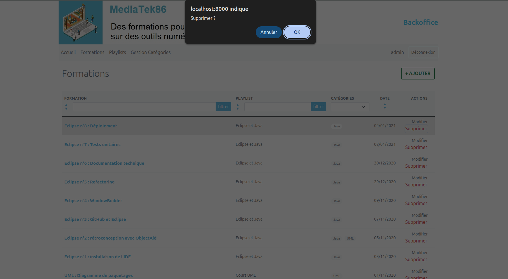

### 📂 Gestion des Playlists
* **Édition des playlists** : Possibilité de créer ou modifier les noms et descriptions des playlists.
* **Gestion des liens** : Mise à jour des formations rattachées à chaque playlist.

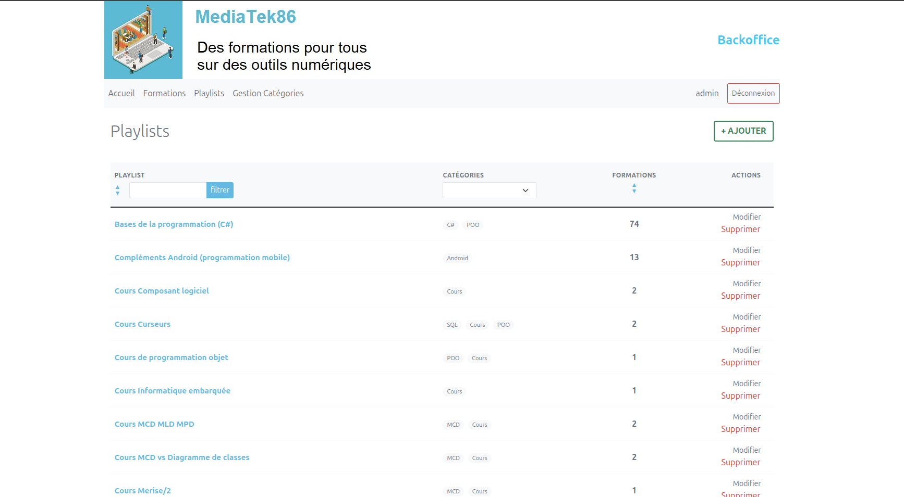
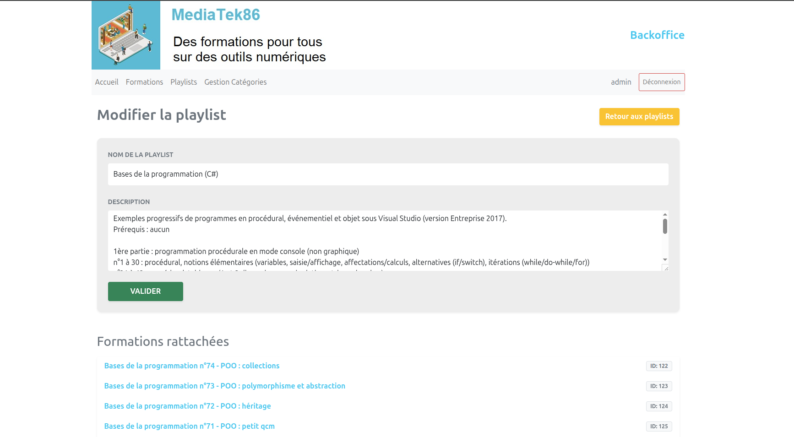
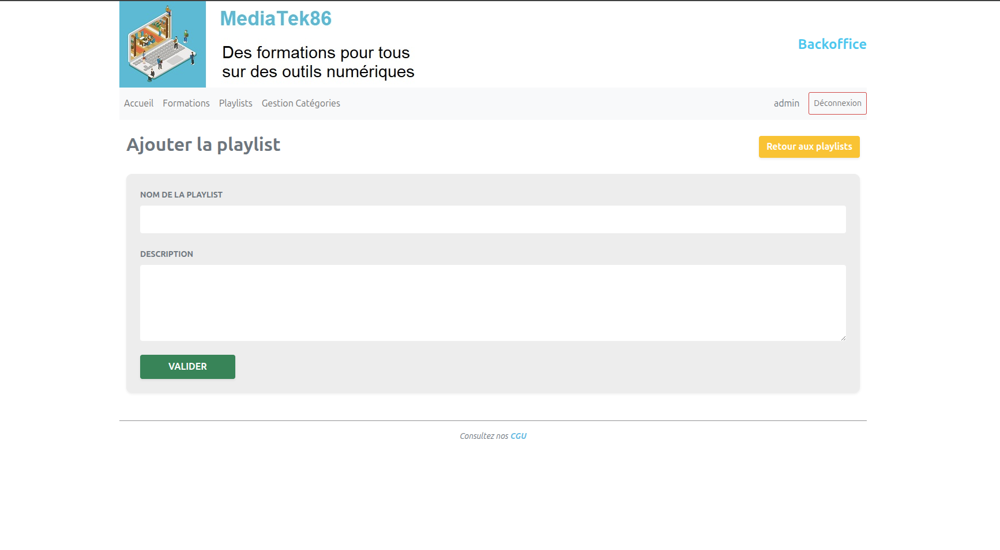
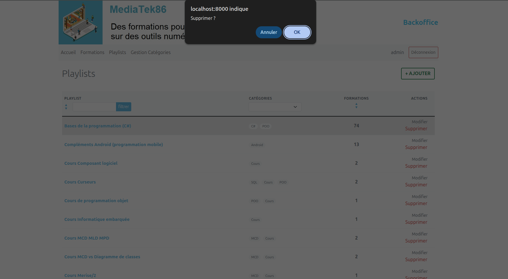

### 🏷️ Gestion des Catégories
* **Organisation dynamique** : Ajout et suppression des catégories (ex: Java, PHP, Design) pour organiser les contenus de formation.

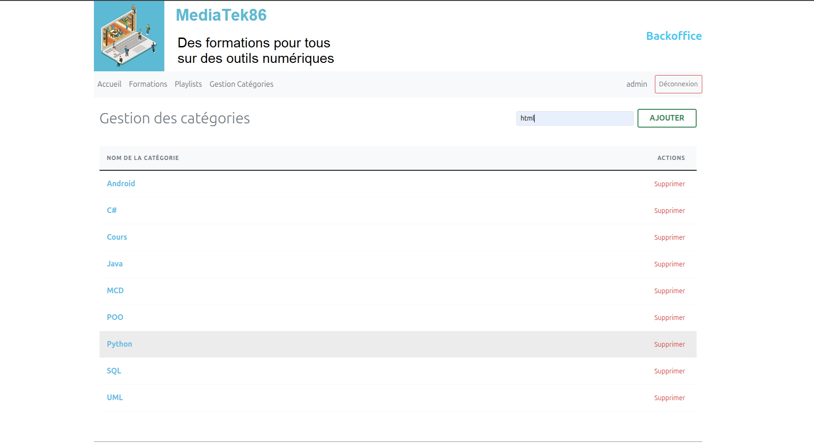
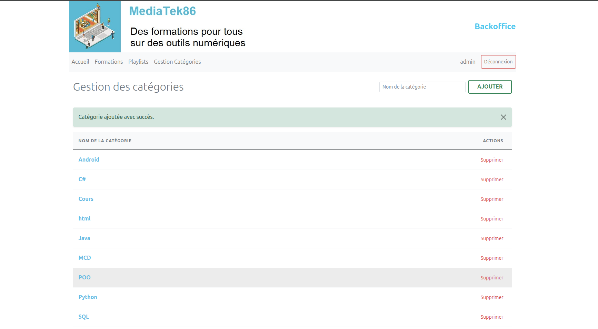
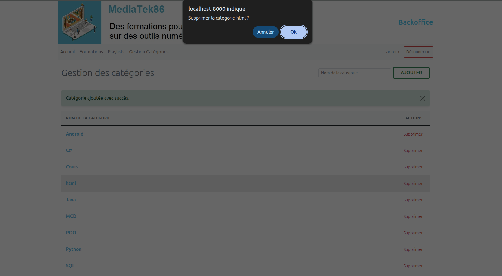
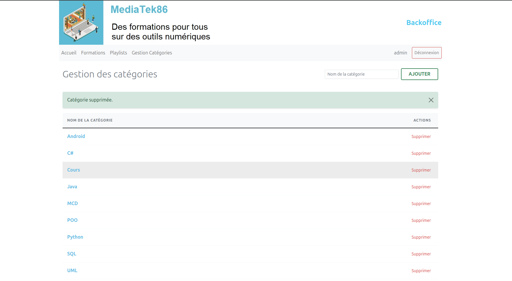

---

## La base de données
La base de données MySQL a été enrichie pour intégrer la gestion des utilisateurs et les évolutions du schéma.

---

## Test de l'application en local

1. **Prérequis** : Vérifier que Composer, Git et Wampserver (ou équivalent) sont installés.
2. **Installation** :
   - Cloner le dépôt : `git clone https://github.com/Giovanni2626/Application-Symfony.git`
   - Se positionner dans le dossier et taper `composer install` pour reconstituer le dossier `vendor`.
3. **Base de données** :
   - Dans phpMyAdmin, créer une base de données nommée `mediatekformation`.
   - Importer le fichier `mediatekformation.sql` situé à la racine du projet.
   - Configurer le fichier `.env` (ou `.env.local`) avec vos identifiants de connexion MySQL.
4. **Lancement** :
   - Ouvrir l'application via un IDE ou via l'adresse : `http://localhost/mediatekformation/public/index.php`

---

## Test de l'application en ligne

L'application est déployée en production à l'adresse suivante :  
👉 **[https://giovanni2626.alwaysdata.net/](https://giovanni2626.alwaysdata.net/)**

### Éléments à tester :
* **Navigation Front-Office** : Vérification des tris et filtres sur les formations et playlists.
* **Accès sécurisé** : Tentative d'accès à l'URL `/login`.
* **Déploiement Continu** : Le site bénéficie d'une mise à jour automatique via **GitHub Actions** à chaque mise à jour du code source.
* **Sauvegardes** : Un système de sauvegarde automatisée a été configuré pour sécuriser la base de données quotidiennement.
